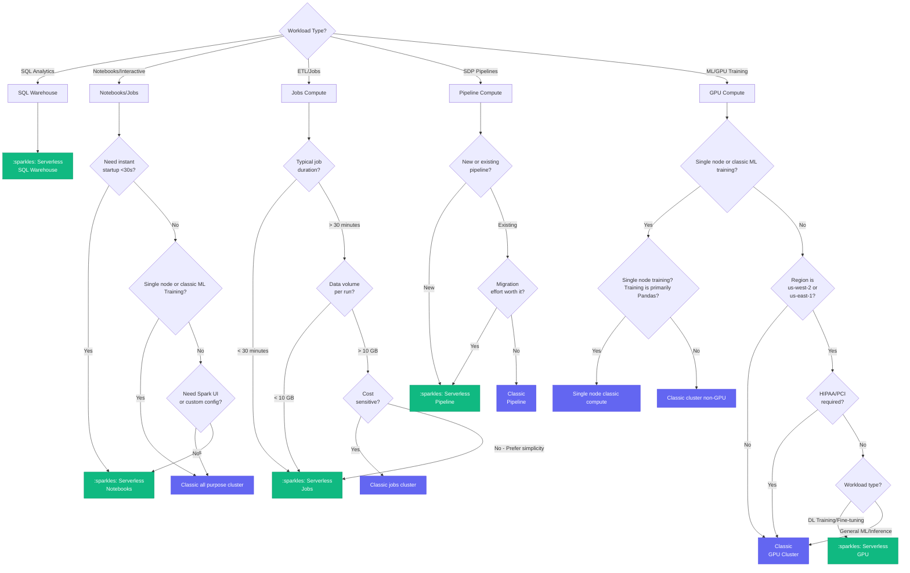

```mermaid
flowchart TD
    
    WORKLOAD{Workload Type?}

    %% Workload type branches
    WORKLOAD -->|SQL Analytics| SQLTYPE[SQL Warehouse]
    WORKLOAD -->|Notebooks/Interactive| NOTEBOOKS[Notebooks/Jobs]
    WORKLOAD -->|ETL/Jobs| JOBS[Jobs Compute]
    WORKLOAD -->|SDP Pipelines| SDP[Pipeline Compute]
    WORKLOAD -->|ML/GPU Training| GPU[GPU Compute]

    %% SQL Warehouse decision
    %%SQLTYPE --> SQLCONCUR{High concurrency<br/>& variable load?}
    %%SQLCONCUR -->|Yes| SERVERLESS_SQL[:sparkles: Serverless<br/>SQL Warehouse]
    %%SQLCONCUR -->|No - Predictable| SQLNET{Custom networking<br/>required?}
    %%SQLNET -->|Yes| PRO_SQL[Pro SQL<br/>Warehouse]
    %%SQLNET -->|No| SERVERLESS_SQL
    SQLTYPE --> SERVERLESS_SQL[:sparkles: Serverless<br/>SQL Warehouse]

    %% Notebooks decision
    NOTEBOOKS --> NB_STARTUP{Need instant<br/>startup <30s?}
    NB_STARTUP -->|Yes| SERVERLESS_NB[:sparkles: Serverless<br/>Notebooks]
    NB_STARTUP -->|No| NB_ML{Single node or classic ML Training?}
    NB_ML -->|Yes| CLASSIC_ALL_PURPOSE[Classic all purpose cluster]
    NB_ML -->|No| NB_CUSTOM{Need Spark UI<br/>or custom config?}
    NB_CUSTOM -->|Yes| CLASSIC_ALL_PURPOSE
    NB_CUSTOM -->|No| SERVERLESS_NB

    %% Jobs decision
    JOBS --> DURATION{Typical job<br/>duration?}
    DURATION -->|< 30 minutes| SERVERLESS_JOBS[:sparkles: Serverless<br/>Jobs]
    DURATION -->|> 30 minutes| DATA_SIZE{Data volume<br/>per run?}
    DATA_SIZE -->|< 10 GB| SERVERLESS_JOBS
    DATA_SIZE -->|> 10 GB| COST_SENS{Cost<br/>sensitive?}
    COST_SENS -->|Yes| CLASSIC_JOBS[Classic jobs cluster]
    COST_SENS -->|No - Prefer simplicity| SERVERLESS_JOBS

    %% SDP (Spark Declarative Pipelines) decision
    SDP --> NEW_PIPE{New or existing<br/>pipeline?}
    NEW_PIPE -->|New| SERVERLESS_SDP[:sparkles: Serverless<br/>Pipeline]
    NEW_PIPE -->|Existing| SDP_MIGRATE{Migration<br/>effort worth it?}
    SDP_MIGRATE -->|Yes| SERVERLESS_SDP
    SDP_MIGRATE -->|No| CLASSIC_SDP[Classic<br/>Pipeline]

    %% GPU decision
    GPU --> ML_CLASSIC{Single node or classic ML training?}
    ML_CLASSIC -->|Yes| ML_SINGLE_NODE{Single node training? Training is primarily Pandas?}
    ML_CLASSIC -->|No| GPU_REGION{Region is<br/>us-west-2 or<br/>us-east-1?}
    ML_SINGLE_NODE -->|Yes| CLASSIC_SINGLE_NODE[Single node classic compute]
    ML_SINGLE_NODE -->|No| CLASSIC_NON_GPU_ML[Classic cluster non-GPU]
    GPU_REGION -->|No| CLASSIC_GPU[Classic<br/>GPU Cluster]
    GPU_REGION -->|Yes| COMPLIANCE{HIPAA/PCI<br/>required?}
    COMPLIANCE -->|Yes| CLASSIC_GPU
    COMPLIANCE -->|No| GPU_TYPE{Workload type?}
    GPU_TYPE -->|DL Training/Fine-tuning| SERVERLESS_GPU[:sparkles: Serverless<br/>GPU]
    GPU_TYPE -->|General ML/Inference| CLASSIC_GPU

    %% Styling
    classDef serverless fill:#10b981,stroke:#059669,color:#fff
    classDef classic fill:#6366f1,stroke:#4f46e5,color:#fff
    classDef decision fill:#fbbf24,stroke:#d97706,color:#000
    classDef start fill:#3b82f6,stroke:#2563eb,color:#fff

    class SERVERLESS_SQL,SERVERLESS_NB,SERVERLESS_JOBS,SERVERLESS_SDP,SERVERLESS_GPU serverless
    class CLASSIC_JOBS,PRO_SQL,CLASSIC_SDP,CLASSIC_GPU,CLASSIC_NON_GPU_ML,CLASSIC_ALL_PURPOSE,CLASSIC_SINGLE_NODE classic
    class START start
```